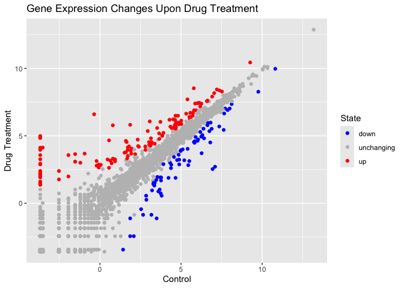
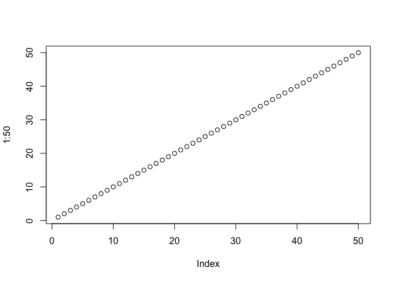

# Class 5: Data viz with
Sydney (PID: A69036053)

# html#change to pdf, save, render

R has lots of ways to make figures and graphs in particular. One that
comes with R out of the box is called **“base” R** - the `plot()`
function.

``` r
plot(cars) # first column on x axis
```


A very popular package in this area is called **ggplot2**

``` r
#/ echo: true
# same thing I don't want in my doc
```

Before i can use any add-on package like this I must install it with the
`install.packages("ggplot2")` command/function. Install packages in the
consol via install.packages(““).

Then to use the package I need to load it with a
`library(ggplot2 # or whatever the name of the package is)` call.

``` r
library(ggplot2)

ggplot(cars) + 
  aes(x=speed, y=dist) +
  geom_point()
```


Code is more concise for base r graphs. ggplot is not worth it unless
the graphs are more complicated. If you are just looking at data, use
base r plots.

Let’s fit a model and show it on my plot:

``` r
ggplot(cars) + 
  aes(x=speed, y=dist) +
  geom_point() + 
  geom_smooth()
```

    `geom_smooth()` using method = 'loess' and formula = 'y ~ x'


``` r
ggsave("myplot.png") # save the graph as a png file
```

    Saving 7 x 5 in image
    `geom_smooth()` using method = 'loess' and formula = 'y ~ x'

``` r
# or 
ggsave("myplot.pdf")
```

    Saving 7 x 5 in image
    `geom_smooth()` using method = 'loess' and formula = 'y ~ x'

Every ggplot has at least 3 layers - layer1 - **data** (data.frame with
the data you want to plot) - layer2 - the **aes**thetics (mapping of
your data columns from your data frame to your plot) - layer 3 -
**geoms**: `geom_point()`, `geom_line()`, `geom_col()` set up aesthetics
before you do the geometries because it plots it in the order on the
code, one on top of eachother (there are tones of these, the basics are
points, lines and columns)

``` r
head(mtcars)
```

                       mpg cyl disp  hp drat    wt  qsec vs am gear carb
    Mazda RX4         21.0   6  160 110 3.90 2.620 16.46  0  1    4    4
    Mazda RX4 Wag     21.0   6  160 110 3.90 2.875 17.02  0  1    4    4
    Datsun 710        22.8   4  108  93 3.85 2.320 18.61  1  1    4    1
    Hornet 4 Drive    21.4   6  258 110 3.08 3.215 19.44  1  0    3    1
    Hornet Sportabout 18.7   8  360 175 3.15 3.440 17.02  0  0    3    2
    Valiant           18.1   6  225 105 2.76 3.460 20.22  1  0    3    1

Make me a ggplot of the `mtcars` data set using `mpg` vs `disp` and set
the size of the points to the `hp`.

``` r
#library(ggrepel) # still need to install
ggplot(mtcars) + 
  aes(x=mpg, y=disp, size=hp, col=am,labels=rownames(mtcars)) + # if color is not in the data, don't put it here
  geom_point( col="blue")  # put color here
```


``` r
  #facet_wrap(~am) + # make subplots based on some faset of your data like am (faciting - separating panels by _)
  #geom_text_repel()
```

Now color all points blue

``` r
rownames(mtcars)
```

     [1] "Mazda RX4"           "Mazda RX4 Wag"       "Datsun 710"         
     [4] "Hornet 4 Drive"      "Hornet Sportabout"   "Valiant"            
     [7] "Duster 360"          "Merc 240D"           "Merc 230"           
    [10] "Merc 280"            "Merc 280C"           "Merc 450SE"         
    [13] "Merc 450SL"          "Merc 450SLC"         "Cadillac Fleetwood" 
    [16] "Lincoln Continental" "Chrysler Imperial"   "Fiat 128"           
    [19] "Honda Civic"         "Toyota Corolla"      "Toyota Corona"      
    [22] "Dodge Challenger"    "AMC Javelin"         "Camaro Z28"         
    [25] "Pontiac Firebird"    "Fiat X1-9"           "Porsche 914-2"      
    [28] "Lotus Europa"        "Ford Pantera L"      "Ferrari Dino"       
    [31] "Maserati Bora"       "Volvo 142E"         

# GENE EXPRESSION PLOT

# Adding more plot aesthetics through aes()

``` r
url <- "https://bioboot.github.io/bimm143_S20/class-material/up_down_expression.txt"
genes <- read.delim(url)
head(genes)
```

            Gene Condition1 Condition2      State
    1      A4GNT -3.6808610 -3.4401355 unchanging
    2       AAAS  4.5479580  4.3864126 unchanging
    3      AASDH  3.7190695  3.4787276 unchanging
    4       AATF  5.0784720  5.0151916 unchanging
    5       AATK  0.4711421  0.5598642 unchanging
    6 AB015752.4 -3.6808610 -3.5921390 unchanging

``` r
nrow(genes)
```

    [1] 5196

``` r
colnames(genes)
```

    [1] "Gene"       "Condition1" "Condition2" "State"     

``` r
ncol(genes)
```

    [1] 4

``` r
table(genes$State)
```


          down unchanging         up 
            72       4997        127 

``` r
round( table(genes$State)/nrow(genes) * 100, 2 ) # 2 significant figures
```


          down unchanging         up 
          1.39      96.17       2.44 

``` r
#unique(genes$State) tells you the unique ones
```

The `table()` function is super useful to tell how many entries of each
type there are. nrow(genes) gives the total number of genes. \# code for
the ggplot

``` r
ggplot(genes)+
aes(x=Condition1, y=Condition2)+
geom_point()
```


There are 5196 genes in this dataset. The functions `nrow()`, `ncol()`
and `table()` are important.

``` r
p <- ggplot(genes) + 
    aes(x=Condition1, y=Condition2, col=State) +
    geom_point()
p
```


``` r
p + scale_colour_manual( values=c("blue","gray","red") )
```


``` r
# add plot annotations to the p object with the labs() function 
# add x and y labels
p+ scale_colour_manual(values=c("blue", "gray", "red"))+
  labs(title='Gene Expression Changes Upon Drug Treatment', x="Control", y="Drug Treatment")
```



- saving plots with **ggsave()**
- different plot types with different **geomes()**
- faceting with **facet_wrap()**
- multiplot layout with the **patchwork** package

# 7 Going Further

## Quarto

Quarto enables you to weave together content and executable code into a
finished document. To learn more about Quarto see <https://quarto.org>.

## Running Code

When you click the **Render** button a document will be generated that
includes both content and the output of embedded code. You can embed
code like this:

``` r
1 + 1
```

    [1] 2

``` r
plot(1:50)
```



You can add options to executable code like this

    [1] 4

The `echo: false` option disables the printing of code (only output is
displayed).
