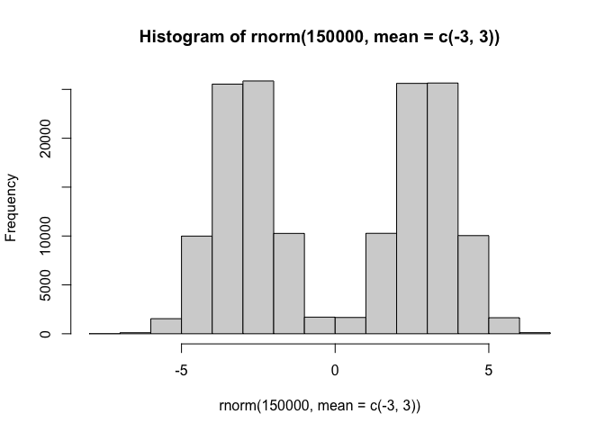
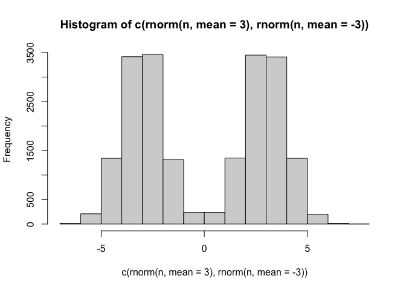
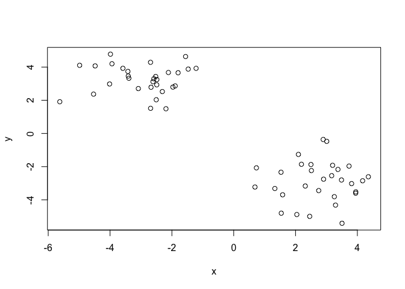
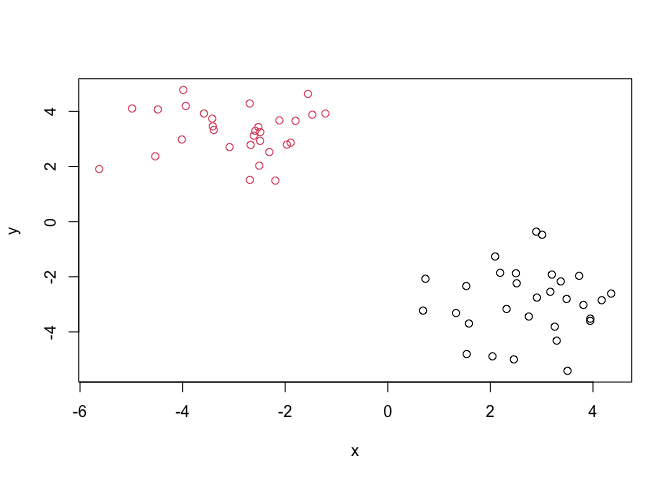
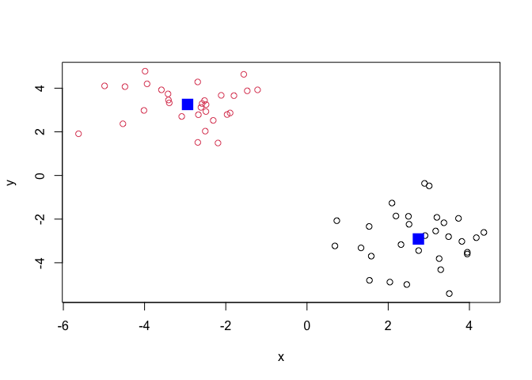
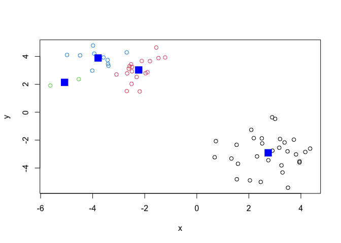
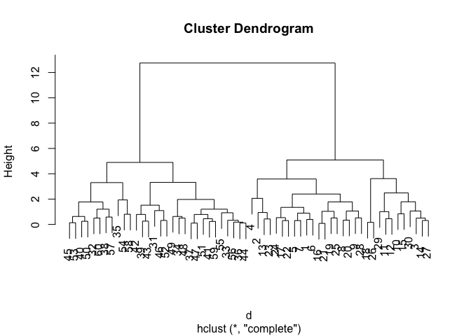
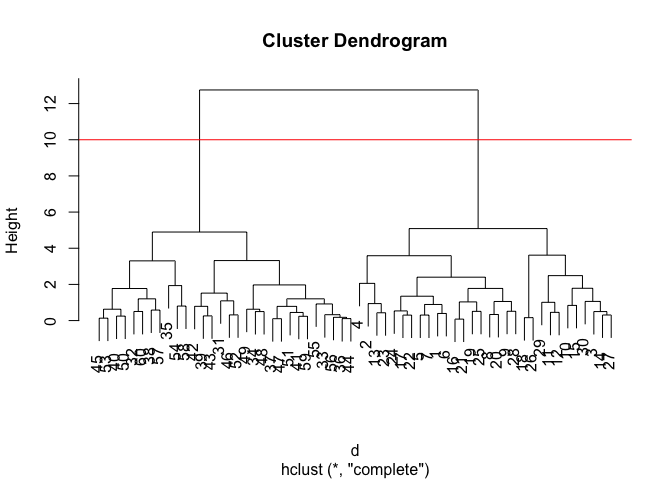
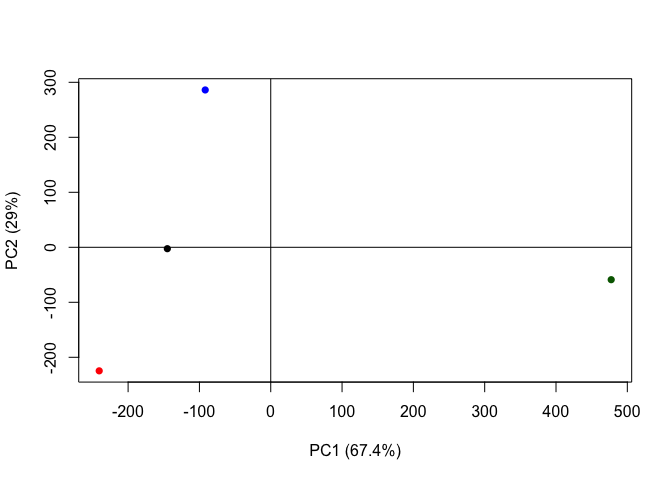

# lab 7 Sydney Ackermann PID: A69036053


Machine learning k clustering

Before we get into clustering methods, let’s make some sample data to
cluster where we know what the answer should be.

To help with this I will use the `rnorm()` function

``` r
hist(rnorm(150000, mean=c(-3,3)))
```



``` r
n=10000
hist(c(rnorm(n,mean=3), rnorm(n, mean=-3)))
```



``` r
n=30
x<-(c(rnorm(n,mean=3), rnorm(n, mean=-3)))
#x
y<-(c(rnorm(n,mean=-3), rnorm(n, mean=3))) # rev(x)
#y
z<-cbind(x,y) # combine the vectors column bind (row bind would combine them row wise)
z
```

                   x          y
     [1,]  3.8136057 -3.0218641
     [2,]  1.5384292 -4.8049851
     [3,]  2.5126840 -2.2369742
     [4,]  3.5038383 -5.4132130
     [5,]  4.1698233 -2.8515899
     [6,]  3.4862715 -2.8041134
     [7,]  4.3553687 -2.6097332
     [8,]  3.1685373 -2.5446935
     [9,]  2.7490482 -3.4424617
    [10,]  1.5302935 -2.3366876
    [11,]  1.5822338 -3.6962617
    [12,]  1.3303648 -3.3177707
    [13,]  2.0409780 -4.8863449
    [14,]  2.1903026 -1.8574792
    [15,]  0.7341241 -2.0718795
    [16,]  3.9482634 -3.5195115
    [17,]  3.3715644 -2.1681132
    [18,]  2.8946287 -0.3629947
    [19,]  3.2547407 -3.8098857
    [20,]  2.9069213 -2.7557258
    [21,]  3.9459143 -3.6004318
    [22,]  3.1982920 -1.9202874
    [23,]  2.4576426 -4.9967794
    [24,]  3.7305712 -1.9665090
    [25,]  3.2932979 -4.3179309
    [26,]  3.0089863 -0.4760862
    [27,]  2.4984026 -1.8723770
    [28,]  2.3151409 -3.1668346
    [29,]  0.6873961 -3.2287155
    [30,]  2.0929771 -1.2637237
    [31,] -2.6911493  4.2864370
    [32,] -4.4822972  4.0707144
    [33,] -2.5231168  3.4326113
    [34,] -2.6886255  1.5148413
    [35,] -5.6260261  1.9112087
    [36,] -2.4853175  3.2477607
    [37,] -1.8932705  2.8649016
    [38,] -3.9872704  4.7779828
    [39,] -1.2166843  3.9237421
    [40,] -3.4226283  3.7374652
    [41,] -2.6746865  2.7841715
    [42,] -1.5564908  4.6341523
    [43,] -1.4713873  3.8790798
    [44,] -2.5824768  3.2963044
    [45,] -3.3915649  3.3266891
    [46,] -1.7988730  3.6586171
    [47,] -1.9674015  2.7931633
    [48,] -2.1916389  1.4887572
    [49,] -2.5053867  2.0316245
    [50,] -3.5844881  3.9243988
    [51,] -2.3088957  2.5240321
    [52,] -2.1126925  3.6723457
    [53,] -3.4108369  3.4586058
    [54,] -4.5333347  2.3687083
    [55,] -3.0851190  2.7044056
    [56,] -2.6116699  3.1203941
    [57,] -3.9379488  4.1988298
    [58,] -4.0147495  2.9814208
    [59,] -2.4893154  2.9304011
    [60,] -4.9840385  4.1053362

``` r
plot(z)
```



k-means clustering

The function in base R for k-clustering is called `kmeans()`.

``` r
km <- kmeans(z, centers=2)
#n=30 so its telling us there are 30 points in each group
# clustering vector is like a membership vector - tells us which cluster each point is closest to
km
```

    K-means clustering with 2 clusters of sizes 30, 30

    Cluster means:
              x         y
    1  2.743688 -2.910732
    2 -2.940979  3.254970

    Clustering vector:
     [1] 1 1 1 1 1 1 1 1 1 1 1 1 1 1 1 1 1 1 1 1 1 1 1 1 1 1 1 1 1 1 2 2 2 2 2 2 2 2
    [39] 2 2 2 2 2 2 2 2 2 2 2 2 2 2 2 2 2 2 2 2 2 2

    Within cluster sum of squares by cluster:
    [1] 72.85873 55.24172
     (between_SS / total_SS =  89.2 %)

    Available components:

    [1] "cluster"      "centers"      "totss"        "withinss"     "tot.withinss"
    [6] "betweenss"    "size"         "iter"         "ifault"      

Q: print out the cluster membership vector

``` r
km$cluster
```

     [1] 1 1 1 1 1 1 1 1 1 1 1 1 1 1 1 1 1 1 1 1 1 1 1 1 1 1 1 1 1 1 2 2 2 2 2 2 2 2
    [39] 2 2 2 2 2 2 2 2 2 2 2 2 2 2 2 2 2 2 2 2 2 2

Plot with clustering result

``` r
#plot(z, col= 1)
#plot(z, col= c("red", "blue"))
#plot(z, col= c(1,2))
# set color equal to the cluster membership vector:
plot(z, col= km$cluster)
```



``` r
plot(z, col= km$cluster) 
points(km$centers, col="blue", pch=15, cex=2) # cex makes point bigger if larger than 1, pch makes it thicker
```



``` r
# in ggplot you have to add layers. here it just does it automatically 

# always have to specify number of clusters
```

Q: Can you cluster our data in `z` into four clusters please?

``` r
km4 <- kmeans(z, centers=4)
plot(z, col= km4$cluster) 
points(km4$centers, col="blue", pch=15, cex=2) 
```



``` r
# This is stochastic so it will be different every time
# kmeans will impose a structure (clustering) on your data even if its not there because you specify how many clusters you want - self fulfilling prophicy
```

Hierarchical clustering The main function to do hierarchical clustering
in base R is called `hclust()`.

Unlike `kmeans()`. I can not just pass in my data as input, I first need
a distance matrix (distance between each points (60x60 and zeros down
the diagonal)).

``` r
d<-dist(z) # make the distance matrix
hc<- hclust(d)
hc
```


    Call:
    hclust(d = d)

    Cluster method   : complete 
    Distance         : euclidean 
    Number of objects: 60 

``` r
# bottom up - start with 60 clusters and then merge them untill we've stuck everything into one cluster - shows us the merging 
# or top down clustering 
```

There is a specific hclust plot() method…

``` r
plot(hc)
```



``` r
plot(hc)
abline(h=10, col="red") # adds line where the cluster number shows because the distance between points is the largest
```



To get my clustering result (i.e., membership vector). I can “cut” my
tree at a given height. To do this I will use the `cutree()`

``` r
grps<- cutree(hc, h=10) # this is our new vector of hierarchial clustering results
grps
```

     [1] 1 1 1 1 1 1 1 1 1 1 1 1 1 1 1 1 1 1 1 1 1 1 1 1 1 1 1 1 1 1 2 2 2 2 2 2 2 2
    [39] 2 2 2 2 2 2 2 2 2 2 2 2 2 2 2 2 2 2 2 2 2 2

Principle component analysis (PCA)

Principal component analysis (PCA) is a well established “multivariate
statistical technique” used to reduce the dimensionality of a complex
data set to a more manageable number (typically 2D or 3D). This method
is particularly useful for highlighting strong paterns and relationships
in large datasets (i.e. revealing major similarities and diferences)
that are otherwise hard to visualize. As we will see again and again in
this course PCA is often used to make all sorts of bioinformatics data
easy to explore and visualize.

``` r
url <- "https://tinyurl.com/UK-foods"
x <- read.csv(url, row.names=1) # make the columns the row names with =1
dim(x)
```

    [1] 17  4

``` r
#View(x) always comment it unless you are looking at it

head(x)
```

                   England Wales Scotland N.Ireland
    Cheese             105   103      103        66
    Carcass_meat       245   227      242       267
    Other_meat         685   803      750       586
    Fish               147   160      122        93
    Fats_and_oils      193   235      184       209
    Sugars             156   175      147       139

``` r
barplot(as.matrix(x), beside=T, col=rainbow(nrow(x)))
```


``` r
pairs(x, col=rainbow(10), pch=16)
```


PCA to the rescue

The main function to do PCA in base R is called `prcomp()`.

Note thatt I need to take the transpose of this particular data as that
is what the `precomp()` help page was asking for.

``` r
x
```

                        England Wales Scotland N.Ireland
    Cheese                  105   103      103        66
    Carcass_meat            245   227      242       267
    Other_meat              685   803      750       586
    Fish                    147   160      122        93
    Fats_and_oils           193   235      184       209
    Sugars                  156   175      147       139
    Fresh_potatoes          720   874      566      1033
    Fresh_Veg               253   265      171       143
    Other_Veg               488   570      418       355
    Processed_potatoes      198   203      220       187
    Processed_Veg           360   365      337       334
    Fresh_fruit            1102  1137      957       674
    Cereals                1472  1582     1462      1494
    Beverages                57    73       53        47
    Soft_drinks            1374  1256     1572      1506
    Alcoholic_drinks        375   475      458       135
    Confectionery            54    64       62        41

``` r
# want to switch colummns and rowes so its accepted into PCA

t(x) # transpose
```

              Cheese Carcass_meat  Other_meat  Fish Fats_and_oils  Sugars
    England      105           245         685  147            193    156
    Wales        103           227         803  160            235    175
    Scotland     103           242         750  122            184    147
    N.Ireland     66           267         586   93            209    139
              Fresh_potatoes  Fresh_Veg  Other_Veg  Processed_potatoes 
    England               720        253        488                 198
    Wales                 874        265        570                 203
    Scotland              566        171        418                 220
    N.Ireland            1033        143        355                 187
              Processed_Veg  Fresh_fruit  Cereals  Beverages Soft_drinks 
    England              360         1102     1472        57         1374
    Wales                365         1137     1582        73         1256
    Scotland             337          957     1462        53         1572
    N.Ireland            334          674     1494        47         1506
              Alcoholic_drinks  Confectionery 
    England                 375             54
    Wales                   475             64
    Scotland                458             62
    N.Ireland               135             41

``` r
pca<- prcomp(t(x))
summary(pca) # pc1 captures 67% of the variation in the data. pc2 captures 29% of the data
```

    Importance of components:
                                PC1      PC2      PC3       PC4
    Standard deviation     324.1502 212.7478 73.87622 2.921e-14
    Proportion of Variance   0.6744   0.2905  0.03503 0.000e+00
    Cumulative Proportion    0.6744   0.9650  1.00000 1.000e+00

``` r
# (67+29=96, therefore, )96% of the varience was captured in 2 dimensions
```

Lets see what is inside our result object `pca` that we just calculated:

``` r
attributes(pca)
```

    $names
    [1] "sdev"     "rotation" "center"   "scale"    "x"       

    $class
    [1] "prcomp"

``` r
pca$x
```

                     PC1         PC2        PC3           PC4
    England   -144.99315   -2.532999 105.768945 -9.152022e-15
    Wales     -240.52915 -224.646925 -56.475555  5.560040e-13
    Scotland   -91.86934  286.081786 -44.415495 -6.638419e-13
    N.Ireland  477.39164  -58.901862  -4.877895  1.329771e-13

To make our main result figure, called a “PC plot” (or “score plot” or
“coordination plot” or “PC1 vs PC2 plot”).

``` r
plot(pca$x[,1], pca$x[,2], col=c("black", "red", "blue", "darkgreen"), pch=16, xlab="PC1 (67.4%)", ylab="PC2 (29%)") # get the first column and the second column and plot the first column against the second (pca1 vs pca2) 
# pch fills in the dots

abline(h=0) # average
abline(v=0)
```



From here we can see that Ireland is off on it’s own. The major axis of
variance. Give more weight to PC1 because it captures more of the
variance. If two points are far apart on PC1 then thats saying there is
a major feature in this data. ireland is the main difference.

Variable loadings plot

Can give us insight on how the original variables (the foods) contribute
to our new PC axis

``` r
## Lets focus on PC1 as it accounts for > 90% of variance 
par(mar=c(10, 3, 0.35, 0))
barplot( pca$rotation[,1], las=2 )
```


``` r
# PC1 -> COMPARING TWO COUNTRIES
```

``` r
pca$rotations
```

    NULL
